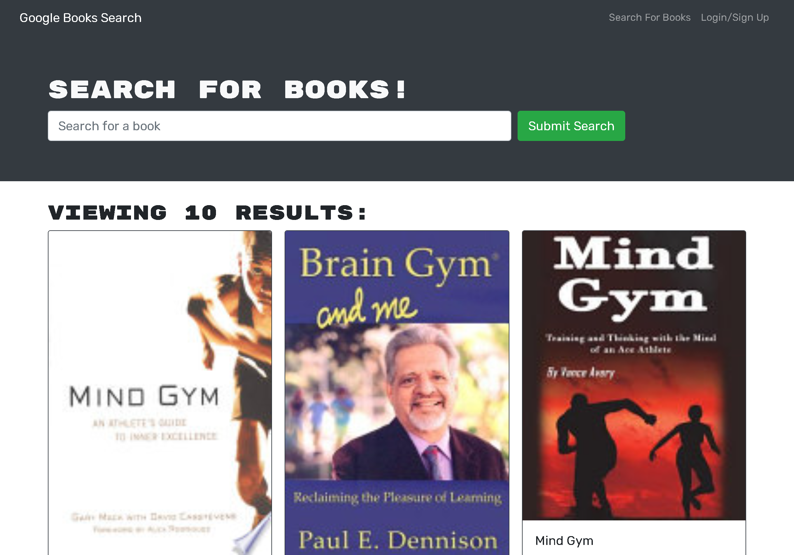

# Book Search Engine

## Contents
1. [About](#About)
2. [Description](#Description)
3. [Screen-Shots](#Screen-Shots)
4. [Contact-Info](#Contact-Info)
5. [License](#License)

## About 
[Deployed Application](https://thawing-oasis-98965.herokuapp.com/)
This app allows a user to search the google API for books and movies. The user is able to create an account to save books as favorites to their account.

## Description
Technologies used in this application include react.js, mongodb, graphql, and apollo. MongoDB is used to to save user information and saved books via queries through graphql. Apollo context is used through out the app to keep track of the user logged in. When viewing search results, users can click on the add to favorites button, this runs a graphql mutation to save the book to their profile.

## Screen-shots

## Contact-Info
Alan Gaudet - <alanmgaudet@gmail.com>

Portfolio - <https://github.com/amgaudet>

## License
MIT License

Copyright (c) 2021 Alan Gaudet

Permission is hereby granted, free of charge, to any person obtaining a copy
of this software and associated documentation files (the "Software"), to deal
in the Software without restriction, including without limitation the rights
to use, copy, modify, merge, publish, distribute, sublicense, and/or sell
copies of the Software, and to permit persons to whom the Software is
furnished to do so, subject to the following conditions:

The above copyright notice and this permission notice shall be included in all
copies or substantial portions of the Software.

THE SOFTWARE IS PROVIDED "AS IS", WITHOUT WARRANTY OF ANY KIND, EXPRESS OR
IMPLIED, INCLUDING BUT NOT LIMITED TO THE WARRANTIES OF MERCHANTABILITY,
FITNESS FOR A PARTICULAR PURPOSE AND NONINFRINGEMENT. IN NO EVENT SHALL THE
AUTHORS OR COPYRIGHT HOLDERS BE LIABLE FOR ANY CLAIM, DAMAGES OR OTHER
LIABILITY, WHETHER IN AN ACTION OF CONTRACT, TORT OR OTHERWISE, ARISING FROM,
OUT OF OR IN CONNECTION WITH THE SOFTWARE OR THE USE OR OTHER DEALINGS IN THE
SOFTWARE.
